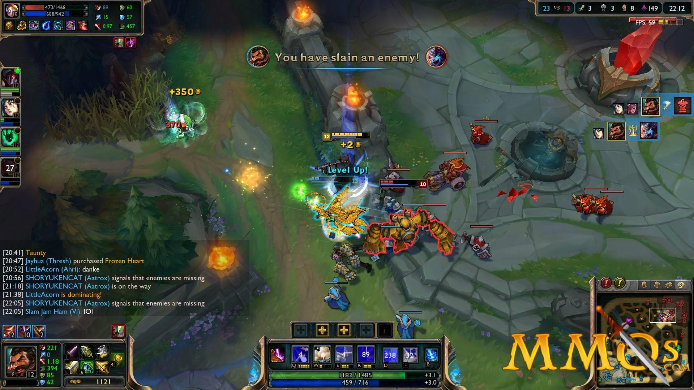

```{r setup, include=FALSE}
knitr::opts_chunk$set(echo = TRUE)

```

# 1. Introduction
League of Legends (LoL) is one of world's most popular multiplayer online battle arena video games. The game was developed and released by Riot Games in 2009. As of August 2018, the game has a stunning active user base of over 111 million players. 

## 1.1 About the game[^1]
The basic of the game is as such: A team (blue or red) of 5 players can each choose one character (known as champions), to battle against another team of 5 players, in an online battle arena. The goal is to destroy the opponent's base, which is located at opposite end of the arena. Whichever team first destroys the opponent's base, wins the game. Champions begin each match at a low level, then slowly gain experience and level by killing non-player characters such as minions and monsters, or by killing enemy champions. Each game typically lasts 20 to 50 minutes.

### 1.1.1 Game map of LoL


Image source: <https://na.leagueoflegends.com/en-us/how-to-play/>

### 1.1.2 A LoL gampeplay screenshot


Image source: <https://mmos.com/review/league-of-legends>

[^1]: Information source: <https://en.wikipedia.org/wiki/League_of_Legends>

## 1.2 About the dataset
We have obtained the dataset from https://www.kaggle.com/bobbyscience/league-of-legends-diamond-ranked-games-10-min. Utilizing the Riot Games API, the author has retrieved the game statistics at 10-minute mark and the final results for about 9.8k games of LoL between closely-ranked players. Each game is unique as identified by the `gameId`. The game statistics are 19 features per team as at the 10-minute mark, such as kills, deaths, gold and experience.

## 1.3 Objective and Goal
The objective of this project is to construct a classification task using the machine learning techniques and other tools which we have learned throughout the HarvardX Data Science Professional Certificate Programme.

Our task will be to predict the win rate of a team using the features as at 10 minute into a game. Throughout this project, we will start by preprocessing the dataset and then conduct some data exploration. We will use several machine learning algorithms to decide on the final model. Lastly we will evaluate our final model on an untouched `validation` set.

Our minimum expectation is to reach an accuracy of prediction of at least 50%, and our goal is 70% using our final model.

***

\newpage

# 2. Data Preprocessing

## 2.1 Overview of data
In this code, we load the libraries required for our work, and the dataset from the `games.csv` file which is uploaded to my Github, and also included together in the project submssion. The dataset was downloaded from the source and yet to be edited.

```{r initialization, message=FALSE, results='hide'}
# Load libraries
library(tidyverse)
library(caret)
library(corrplot)
library(stringr)
library(rpart)
library(gbm)

# Load data file from github
dl <- tempfile()
download.file("https://github.com/limhongwei/lol/raw/master/games.csv", dl)
games <- read.csv(dl, stringsAsFactors = FALSE)
```

A quick look at the data:

```{r glimpse}
# Brief look at dataset
glimpse(games)
```

It shows a dataset of `r nrow(games)` games, with 19 features of Blue and Red Teams.
`blueWins` is `1` if the blue team wins, `0` otherwise.

### 2.2 Glossary of features

| Feature | Description |
|---------|-------------|
| Warding totem | An item that a player can put on the map to reveal the nearby area. It can be placed and/or destroyed by opponent. |
| Minions | NPC (non-player character) that belong to both teams. They give gold when killed by players. |
| Jungle minions | NPC that belong to NO TEAM. They give gold and buffs when killed by players. |
| Elite monsters | Monsters with high hp/damage that give a massive bonus (gold/XP/stats) when killed by a team. |
| Dragons | Elite monster which gives team bonus when killed. |
| Herald | Elite monster which gives stats bonus when killed by the player. It helps to push a lane and destroys structures. |
| Towers | Structures you have to destroy to reach the enemy Nexus. They give gold. |
| Level | Champion level. Start at 1. Max is 18. |
| Kill/Death/Assist | KDA count of the team when battling enemy players. |

## 2.3 Preprocessing Plan

After examining the database structure briefly, here is our plan for preprocessing:

- Check for NA values, if any.
- The dataset is considered to be in wide table format - where Blue team features and Red team features are the mostly the same (except for the lack of "redWins"), but separated in columns. So we will need to reshape the data so that the columns are the predictors that we want to use.
- Remove irrelevant variables, and derived variables.
- Remove near zero variance variables, if any.

### 2.3.1 Check NA values

Using this code:
```{r checkna}
# Check NA values
sum(sapply(1:ncol(games), function(x) sum(is.na(games[,x]))))
```

The result shows that there is no NA values.

### 2.3.2 Reshape data

In this code, we reshape the data by so that it is in a tidy format for our machine learning.
```{r reshape}
# Tidy data
temp <- games %>% 
  mutate(redWins = ifelse(blueWins==1,0,1)) %>% 
  gather(key, value, -gameId)
temp$key <- str_replace_all(temp$key, "blue", "blue_")
temp$key <- str_replace_all(temp$key, "red", "red_")
games_clean <- temp %>% 
  separate(key, c("team", "variable"), "_") %>%
  spread(variable, value)
```

Here is how the data looks like after reshaping:
```{r glimpse_clean}
# Brief look at tidy data
glimpse(games_clean)
```

### 2.3.2 Remove irrelevant variables, and derived variables

First of all, `gameId` is an identifier of a game, therefore it is irrelevant to the win rate.

The variable `team` can be removed too. Choosing "blue" or "red" should not have effect on the win rate, since the probability of winning should be 0.5. This is confirmed by:
```{r meanblue}
# Win rate of choosing Blue team should be 0.5
mean(games$blueWins==1)
```

Examining the dataset columns and the first few values, we observe that these few variables are derived from other variables in the same dataset:

- GoldPerMin = TotalGold $\div$ 10 minutes
- CsPerMin = TotalMinionsKilled $\div$ 10 minutes
- We suspect that EliteMonsters equals to the sum of Dragons and Heralds since both of them are elite monsters 

```{r derivedvar}
# Check derived variables
games_clean %>% 
  mutate(count1 = GoldPerMin - TotalGold/10,
         count2 = CSPerMin - TotalMinionsKilled/10,
         count3 = EliteMonsters - Dragons - Heralds) %>% 
  summarize(count1 = sum(count1), 
            count2 = sum(count2), 
            count3 = sum(count3))
```

The summary of all counts showing zeroes, indicates the 3 variables above are derived and therefore redundant.

### 2.3.3 Remove near zero variance variables

We also use the `nearZeroVar` function to check if there is any variable which has very few unique values relative to the number of samples, and the ratio of the frequency of the most common value to the frequency of the second most common value is large.

```{r nearzerovar}
# Check near zero variance variables
nearZeroVar(games_clean, saveMetrics = TRUE)
```

The table shows that `TowersDestroyed` has too few unique values, and might adversely affect the machine learning process.

Here we remove the variables mentioned above, and also change the class of `Wins` to a factor class.
```{r removevar}
# Remove irrelevant, derived and near zero variance variables
games_clean <- games_clean %>% 
  select(-gameId, -team, -GoldPerMin, -CSPerMin, -EliteMonsters, -TowersDestroyed) %>%
  mutate(Wins = factor(Wins))
```

After data preprocessing, our dataset now has 1 dependent variable `Wins` (win rate), and 15 independent variables (predictors). We are now ready for data exploration in the next section.
```{r afterpreprocess}
# Brief look at data ready for exploration
str(games_clean)
```

***

\newpage

# 3. Data Exploration

## 3.1 Splitting the data

Before we perform any data exploration, we first split the data into a `main` set and a `validation` set. This is to ensure that the **validation set is not being used to form any opinion or conclusion during the data exploration or model training process**. The validation set will only be used for the evaluation of the final algorithm.

We choose a ratio of 80/20 as we think that the dataset is not exactly too large, and there are data on all observations (unlike a sparse dataset). So, we allocate more room to the validation set. The 80% `main` set will be further split into 90/10 for model training. In short, the dataset will be split into:

- 72% for training
- 8% for testing
- 10% for validation

```{r firstsplit, results='hide', warning=FALSE, message=FALSE}
# First split of data into 80/20
set.seed(2020, sample.kind = "Rounding") 
# if using R 3.5 or earlier, use `set.seed(2020)` instead
test_index <- createDataPartition(games_clean$Wins, times = 1, p = 0.2, list = FALSE)
main <- games_clean[-test_index,]
validation <- games_clean[test_index,]
```

We will be using the `main` set throughout this section and next section (Model Training).

## 3.2 Win rate

As expected, the win rate should be 0.5.
```{r winrate}
# Win rate of choosing either Blue or Red should be 0.5
mean(main$Wins==1)
```

## 3.3 Correlations

Let's generate a correlation plot between the predictors.
```{r corrplot}
# Correlation among predictors
temp <- main %>% select(-Wins)
tempcor <- cor(temp)
corrplot::corrplot(tempcor, type = "lower")
```

`Kills` and `TotalGold` have high positive correlation since the more kills the team get, the more gold the team will receive. `GoldDiff` and `Deaths` have high negative correlation too.

## 3.4 Distributions

We also take a look at the distribution of all the predictors.
```{r distributions}
# Distribution of preodictors
main %>% gather(key, value, -Wins) %>% 
  ggplot(aes(value, fill = Wins)) + 
  geom_density(aes(y = ..density..), kernel = "gaussian", alpha = 0.6) +
  facet_wrap(~key, scales = "free")
```

`WardsPlaced` and `WardsDestroyed` seem to be very skewed to the left. The range of `WardsPlaced` seems to be quite far-fetched. We have some doubts as whether a team can place more than 200 wards within 10 minutes into a game. The range of `WardsDestroyed` does not seem to match the wide range of `WardsPlaced` either. There could be some errors in these two variables. We will need to relook into this if we have the chance to reach out to an LoL player.
```{r wardsrange}
# Range of 'WardsPlaced' and 'WardsDestroyed' seem to be far-fetched
range(main$WardsPlaced)
range(main$WardsDestroyed)
```

## 3.5 Variable importance

We utilise the `varImp` function in the `caret` package to help us to gauge which are the most important features using different algorithms.

```{r varimp_rf}
# Variable importance using Random Forest
main_rf <- train(Wins ~ ., method = "rf",
                 data = main,
                 ntree = 100)
plot(varImp(main_rf), main = "Variable Importance using Random Forest")
```

For comparison, we also use Logistic Regression to see if any variable stands out in both algorithms.
```{r varimp_glm}
# Variable importance using Logistic Regression
main_glm <- train(Wins ~ ., 
                  method = "glm", 
                  data = main)
plot(varImp(main_glm), main = "Variable Importance using Logistic Regression")
```

`GoldDiff` and `ExperienceDiff` come out top in both algorithms.

***

\newpage

# 4. Model Training

In this section, we begin to train our data using a variety of models. We choose some models suitable for classification task.

## 4.1 Second split

Here we perform a second split of `main` set into 90/10 for `train_set` and `test_set`.
```{r second split, results='hide', warning=FALSE, message=FALSE}
# Second split of 90/10 for model training
set.seed(2020, sample.kind = "Rounding") 
# if using R 3.5 or earlier, use `set.seed(2020)` instead
test_index <- createDataPartition(main$Wins, times = 1, p = 0.1, list = FALSE)
train_set <- main[-test_index,]
test_set <- main[test_index,]
```

## 4.2 Model Training

We choose a variety of models (11 models suitable for classification task) here:
```{r choosemodel}
# Model training of train_set vs test_set
models <- c("naive_bayes", "gamLoess", "lda", "qda", "glm", "glmboost",
            "pls", "multinom", "knn", "gbm", "rpart")
```

In this code, we use the `train_set` to fit the models. We will use all the predictors in the data.
```{r training, results='hide', warning=FALSE, message=FALSE}
fits <- lapply(models, function(model){
  set.seed(2020, sample.kind = "Rounding") 
  # if using R 3.5 or earlier, use `set.seed(2020)` instead
  print(model)
  train(Wins ~ ., method = model, data = train_set)
})
names(fits) <- models
pred <- sapply(fits, function(object) predict(object, newdata = test_set))
```

Then we predict the win rates for `test_set`. We extract the **Accuracy**, **Sensitivity**, and **Specificity** values for each model, which we will use to measure the performance of the model.
```{r output}
# Generate output of model training
out <- sapply(seq(1,length(models),1), function(x){
  cm <- confusionMatrix(factor(pred[,x]), test_set$Wins)
  acc <- cm$overall["Accuracy"]
  sens <- cm$byClass["Sensitivity"]
  spec <- cm$byClass["Specificity"]
  return(c(acc, sens, spec))
})
```

We consolidate the results using this code:
```{r generateresults}
# Generate results of model training
labels <- sapply(seq(1,length(models),1), function(x) getModelInfo(models[x])[[1]]$label)
results <- tibble(Model = models, Label = labels)
temp <- out %>% t %>% as.data.frame()
results <- cbind(results, temp)
```

Here is the results:
```{r results_table, results='asis', echo=FALSE}
knitr::kable(results, caption = "Results of Model Training")
```

The mean accuracy is:
```{r meanacc}
mean(results$Accuracy)
```

Let's do a quick comparison plot between the models:
```{r comparemodels}
# Comparing models
models_compare <- resamples(fits)
scales <- list(x=list(relation="free"), y=list(relation="free"))
bwplot(models_compare, scales=scales)
```

It seems that logistic regression models such as `glmboost`, `gbm` and `gamLoess` have higher accuracies compared to other models.

## 4.3 Ensemble

Instead of choosing a single model, we will use an ensemble technique for our final model. Ensemble allows us to combine two or more models and it should make our final model to be more robust and less likely to be biased.

## 4.3.1 Ensemble with average

This approach is basically taking the average of the predictions of all the models we used in model training. The accuracy of this ensemble method is simply the average accuracy.
```{r ensemble_avg}
# Ensemble by Average
acc_avg <- mean(results$Accuracy)
acc_avg
```

## 4.3.2 Ensemble with majority vote

A majority vote approach allows us to take recommendation from multiple models prediction. Using the following code, we construct an ensemble by majority vote where prediction of `Wins` = 0 if more than 50% of the models predict 0, and vice versa.
```{r ensemble_majority}
# Ensemble by Majority Vote
votes <- rowMeans(pred=="0")
y_hat <- ifelse(votes > 0.5, "0", "1")
acc_mv <- mean(y_hat == test_set$Wins)
acc_mv
```

The accuracy of ensemble method `r acc_mv` shows an improvement from the first ensemble approach above.

## 4.3.3 Ensemble with stacking

Stacking is an interesting ensemble approach where we perform a second layer of training on top of the first stage of model training. We choose to use a logistic regression model `glm` in the second layer.

In order for our logistic regression model at the top layer to work, we will need to remove the highly correlated models among the 11 models during our model training. We use a cutoff correlation level of 0.75. Here are the models after the cutoff:
```{r remove_highcor}
# Remove models with more than 0.75 correlation
a <- modelCor(models_compare)
x <- findCorrelation(a, cutoff = .75)
selected <- colnames(a[,-x])
selected
```

The approach to ensemble stacking:

1. First we fit `selected` models on the `train_set`.
2. We add the predicted values into the `train_set`, let's call it `stack_train`.
3. We also add the predicted values (already done in model training) into `test_set`, let's call it `stack_test`.
4. Now we fit another model (we use a logistic regression model `glm`) to `stack_train`, where the predicted values in step 2 are now the predictors.
5. We use the model trained in step 4, to make prediction on `stack_test`.

We achieve the steps above using the following code:
```{r ensemble_stacking, warning=FALSE}
# Ensemble by Stacking
pred_train <- sapply(fits[selected], function(object) predict(object, newdata = train_set))
stack_train <- train_set %>% cbind(pred_train)
stack_test <- test_set %>% cbind(pred[,selected])
set.seed(2020, sample.kind = "Rounding") 
# if using R 3.5 or earlier, use `set.seed(2020)` instead
model_glm <- train(stack_train[selected], stack_train$Wins, method = "glm")
y_hat_stack <- predict(model_glm, stack_test[selected])
acc_stack <- mean(y_hat_stack==stack_test$Wins)
acc_stack
```

Let's look at our result so far:
```{r acc_results}
# Result of different ensembles
ensem <- tibble(Method = c("Ensemble by Average",
                           "Ensemble by Majority Vote",
                           "Ensemble by Stacking"),
                Accuracy = c(acc_avg, acc_mv, acc_stack))
```

```{r acc_table, results='asis', echo=FALSE}
knitr::kable(ensem, caption = "Results of Ensemble Approach")
```

## 4.4 Final model

While all of three ensemble approaches each yields accuracy that is much higher than 50%, we will choose the **Ensemble with Majority Vote** as our final model. It is a more balanced model which considers all 11 models in the model training, and it also gives the highest accuracy among the three approaches.

***

\newpage

# 5. Result
We are now ready to evaluate our final model on the `validation` set to see how it performs. To be on the conservative side, we remain to use the `train_set` (which is a smaller set than `main` set) to train the predictors.

Here is the code:
```{r validation, results='hide', warning=FALSE, message=FALSE}
# Test final model using validation set
fits <- lapply(models, function(model){
  set.seed(2020, sample.kind = "Rounding") 
  # if using R 3.5 or earlier, use `set.seed(2020)` instead
  print(model)
  train(Wins ~ ., method = model, data = validation)
})
names(fits) <- models
pred <- sapply(fits, function(object) predict(object, newdata = validation))

# Ensemble with majority vote on validation set
votes <- rowMeans(pred=="0")
y_hat <- ifelse(votes > 0.5, "0", "1")
acc_val <- mean(y_hat == validation$Wins)
acc_val
```

Our final model on validation yields an accuracy of `r acc_val`, and it is above our target of 70%.

***

\newpage

# 6. Conclusion

## 6.1 Summary

We started the project with a dataset with near 40 predictors. We have made considerable effort to reshape the data, and we use our judgement to remove variables which are less likely to help with our predictions. We also explore the data using different approaches - correlations, distributions and variable importance. Then we use a variety of classification models to form our ensemble model. After testing several ensemble approaches, we decide to use **Ensemble with Majority Voting** as our final model.
Upon testing on the untouched `validation` set, our final result of `r acc_val` exceeds our goal of 70%.

## 6.2 Comments

Throughout our model training, we try to achieve an accuracy as high as possible without overfitting. While we are satisfied with the accuracy that we achieve in this project, we believe that our final model can be improved if we could collect more data from the Riot Games API. Some of the game statistics that could be helpful are heroes choice, minimum and maximum hero level of a team etc.

When it comes to model training, we did not include or use any individual model tuning. This is because when we tried to tune some of the models such as k-nearest neighbour and random forest, the accuracy did not improve by much and the computation time is too long.

Finally, I just want to say that I have gained significant knowledge and experience through this project and the courseworks. I am also glad that I were given the opportunity to apply this knowledge on real-world data and potentially meaning application.

***

\newpage

# 7. Acknowledgement

Special thanks to the sources:

- Michel's fanboi from Kaggle <https://www.kaggle.com/bobbyscience/league-of-legends-diamond-ranked-games-10-min>
- League of Legends Wikipedia Page <https://en.wikipedia.org/wiki/League_of_Legends>
- HarvardX Data Science Professional Certificate Programme by edx
- Professor Rafael Irizarry <https://rafalab.github.io/dsbook/index.html>